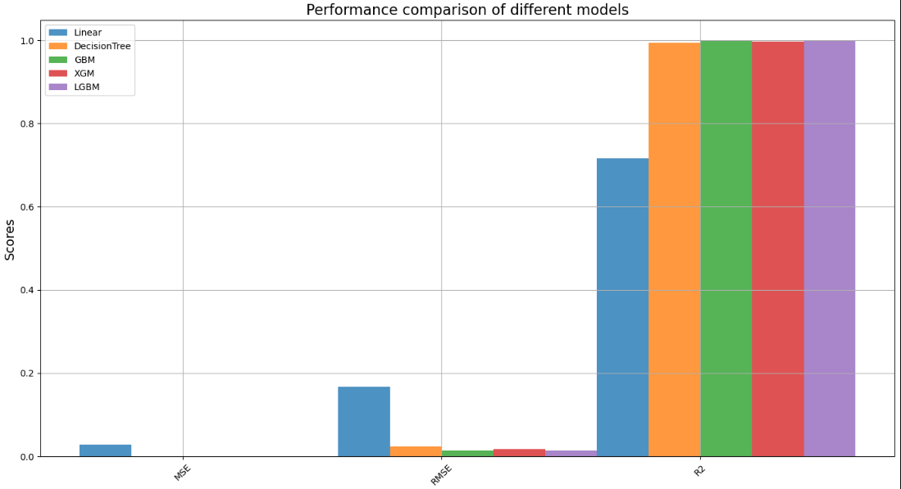
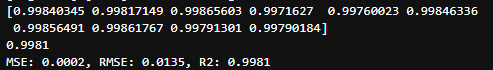
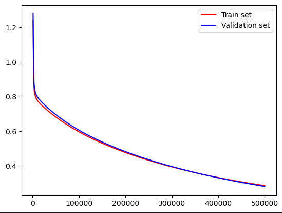
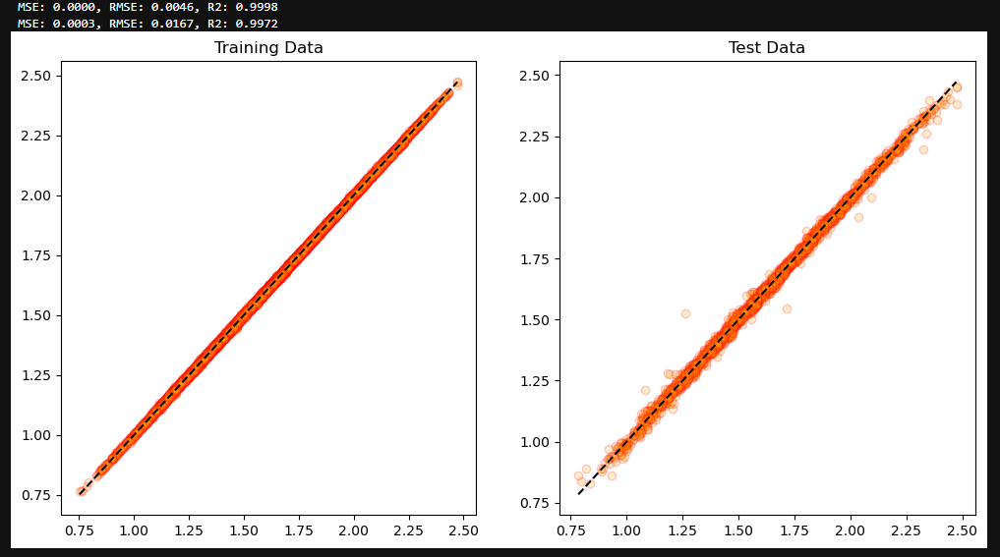
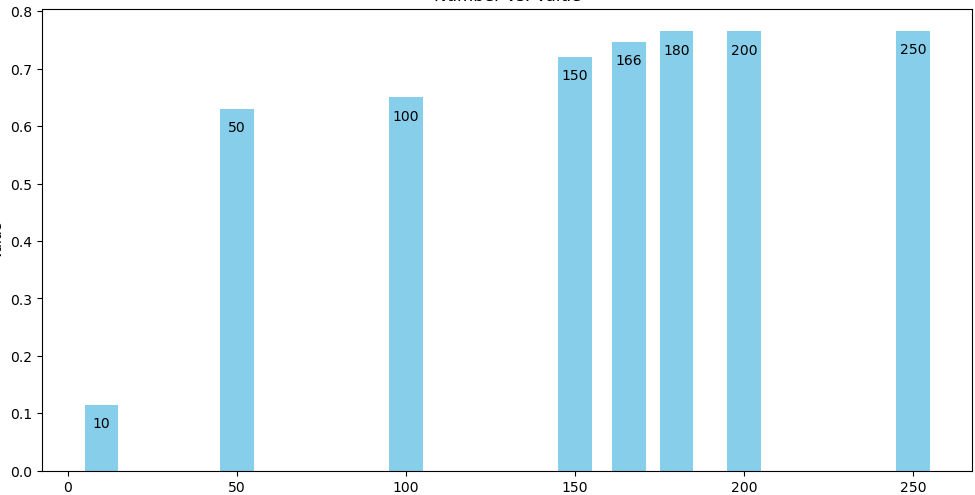
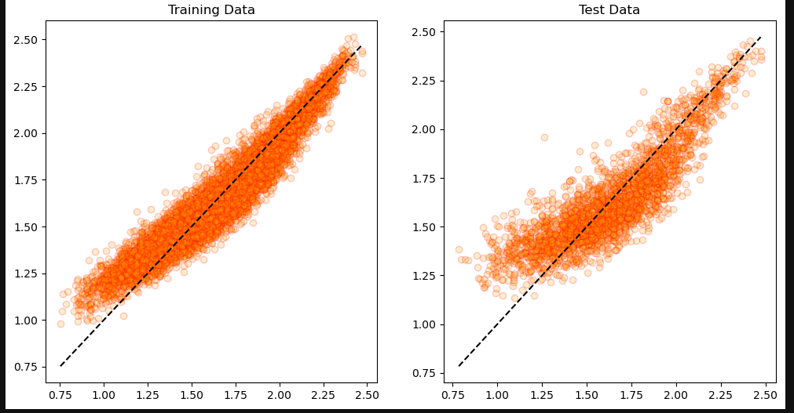
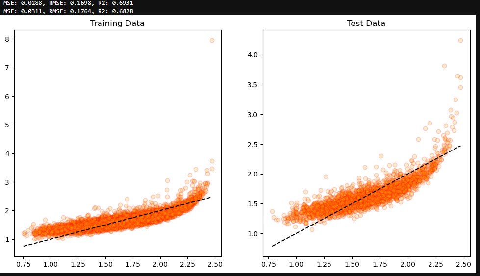

### 경마 승률예측

#### Features
         
 -  dtypes: bool(2), float64(381), int64(26), object(15)
 -  총 427개의 피쳐       

#### Target

 -  Win Odds : 승리 확률


#### 목표

 - 경마 경기의 특정 경주마의 승률을 예측하여 가장 높은 경주마가 어떤 것인지 찾아내는 판단을 할 수 있는 모델을 만든다.

---

#### 기본 전처리

- 데이터에 결측지, 중복행 X
- 불필요 features 삭제
  

- 범주형 데이터 label_encoders 진행  
- target데이터 PowerTransformer 진행  
  
  


- 먼저 전체 모델들을 이용하여 선형 회귀 예측을 수행


```
LinearRegression
MSE: 0.0279, RMSE: 0.1670, R2: 0.7157
DecisionTreeRegressor
MSE: 0.0006, RMSE: 0.0242, R2: 0.9940
GradientBoostingRegressor
MSE: 0.0002, RMSE: 0.0142, R2: 0.9979
XGBRegressor
MSE: 0.0003, RMSE: 0.0167, R2: 0.9972
LGBMRegressor
MSE: 0.0002, RMSE: 0.0135, R2: 0.9981

```

- 트리모델들의 R2가 매우 높은수치를 보이고 있어 과적합 가능성이 있고 확인필요

- Kfold cross_val_score를 통한 비교


-  Pytorch를 통해 loss를 통한 비교


-  LGBM모델 사용하였을때 학습데이터와 테스트 데이터의 대한 예측값


---

#### 차원축소

- LGBM모델을 이용 pca로 차원축소 진행


- 과적합 의심


```
MSE: 0.0098, RMSE: 0.0991, R2: 0.8954
MSE: 0.0238, RMSE: 0.1541, R2: 0.7577

```

- Ridge사용하여 과적합 방지



---

#### 결론

- pca를 통한 적절한 차원축소를 적용 후 Ridge를 사용하여 과적합을 방지한다.
- 모델을 사용해서 경마를 한다면 어떠한 경주마에 걸어야 그나마 승리할수 있는지 판단한다.
