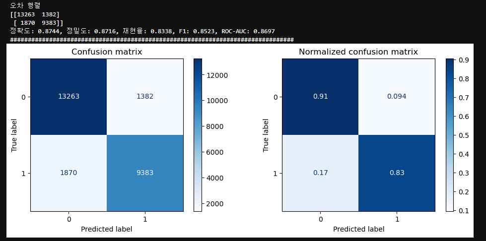
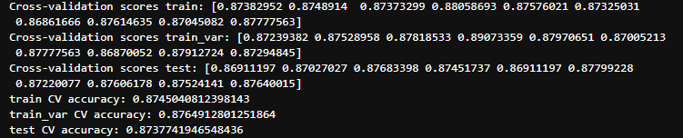
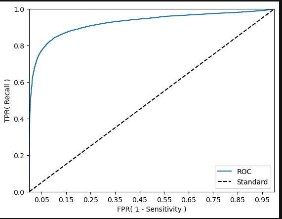
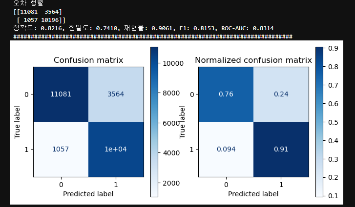
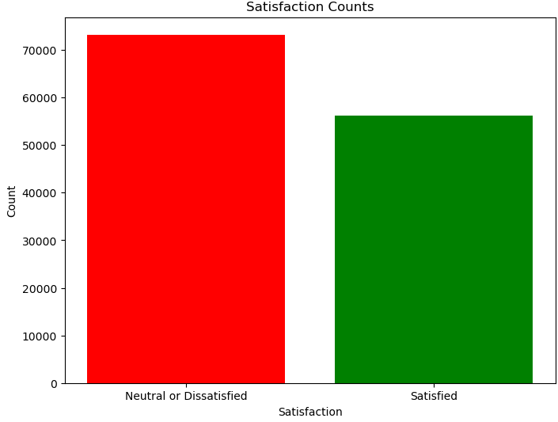
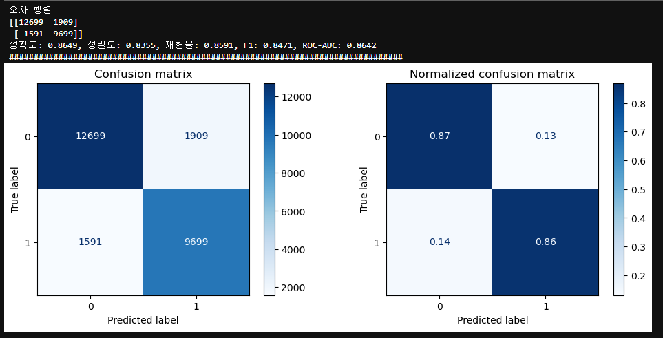
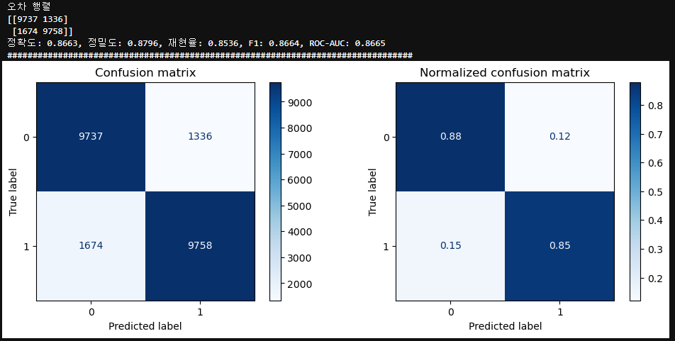
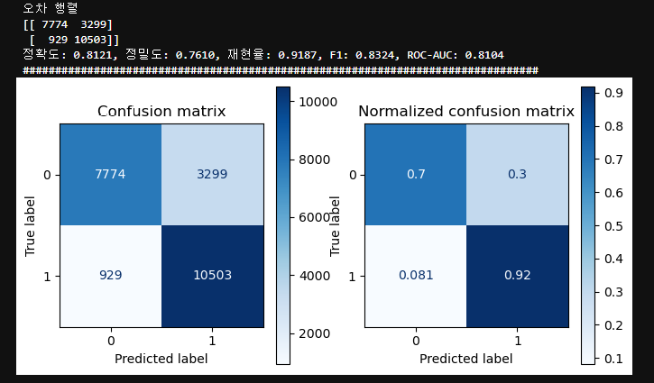

### 항공사 만족도 

#### Features
         
 -  Gender: 성별                                  
 -  Age: 나이                                     
 -  Customer Type: 고객 유형                           
 -  Type of Travel: 여행 유형                          
 -  Class: 좌석 등급                                   
 -  Flight Distance: 비행 거리                         
 -  Departure Delay: 출발 지연                         
 -  Arrival Delay: 도착 지연                           
 -  Departure and Arrival Time Convenience: 출발 및 도착 시간 편의성  
 -  Ease of Online Booking: 온라인 예약 편의성                  
 -  Check-in Service: 체크인 서비스                        
 -  Online Boarding: 온라인 탑승                            
 -  Gate Location: 탑승 게이트 위치                         
 -  On-board Service: 기내 서비스                          
 -  Seat Comfort: 좌석 편안함                             
 -  Leg Room Service: 다리 공간 서비스                     
 -  Cleanliness: 청결도                                  
 -  Food and Drink: 음식 및 음료                            
 -  In-flight Service: 기내 서비스                           
 -  In-flight Wifi Service: 기내 와이파이 서비스                  
 -  In-flight Entertainment: 기내 엔터테인먼트                   
 -  Baggage Handling: 수하물 처리                          

#### Target

 -  Satisfaction: 만족도  

---  
  
 - 소량의 결측치 제거(393개)  
  

 - Logistic모델을 사용해서 오차행렬 시각화

 - Kfold cross_val_score를 통한 과적합 확인

---

임계치 조정

양성(Positive): 항공사 서비스 만족  
음성(Negative): 항공사 서비스 불만족   

True Positive (TP):항공사 서비스에 만족을 한다고 예측  -> 실제로 만족  
False Positive (FP) : 항공사 서비스에 대한 불만족을 예측했지만 실제로는 만족한 경우입니다. (오류, error)  
True Negativ (TN) : 항공사 서비스에 대한 만족을 예측했고, 실제로도 만족하지 않은 경우입니다  
False Negati (FN) : 항공사 서비스에 대한 만족을 예측했지만 실제로는 불만족한 경우입니다(놓침, error II)  

정밀도(Precision)는 모델이 만족을 예측한 경우 중에서 실제로 고객이 만족한 비율을 의미합니다.  
재현율(Recall)은 실제로 만족한 고객 중에서 모델이 정확하게 만족을 감지한 비율을 나타냅니다.다.  

🏆임계치낮춰여재현율을도를 높여주는 것이 적합하다.

---

- ROC, Threshold 확인
  
  

- Threshold 조절

---
SMOTE, undersampling 확인해보기

- target 분포도

- SMOTE

- undersampling 

- undersampling Threshold 조절

