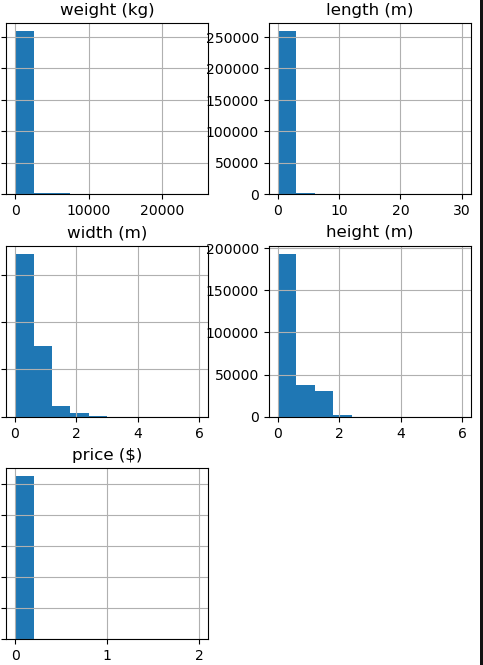
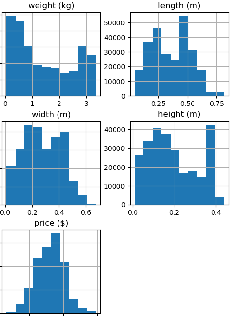
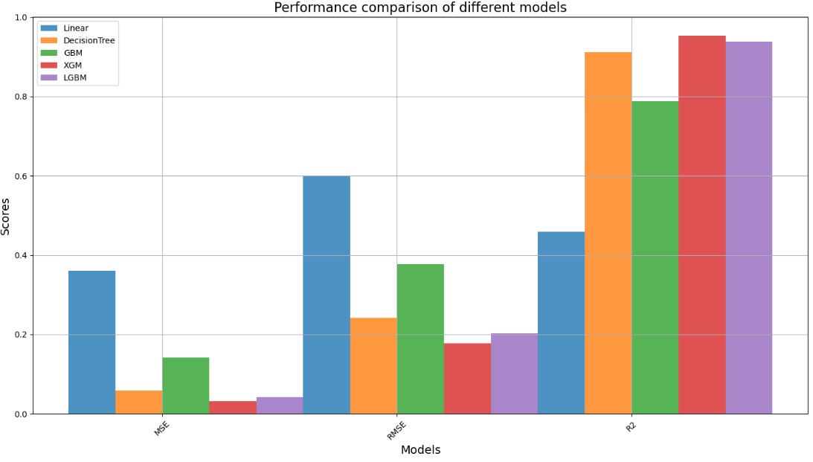
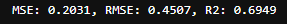
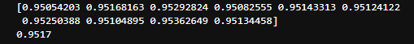
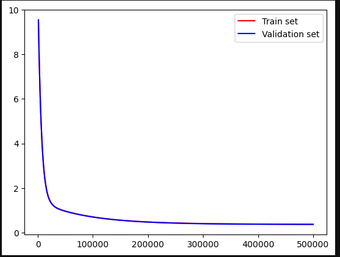
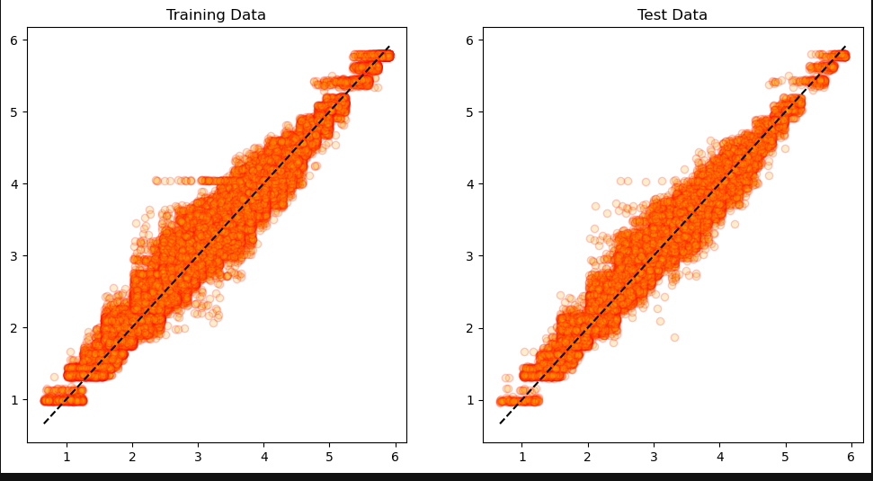

### 물류 비용 예측

#### Features
         
 -  name: 물품명             
 -  weight (kg): 무게 (킬로그램)      
 -  length (m): 길이 (미터)       
 -  width (m): 너비 (미터)        
 -  height (m): 높이 (미터)       
 -  destination port: 목적지 항구             

#### Target

 -  price ($): 가격 (달러)


#### 목표

 - 물품을 배송할때 크기와 무게, 목적지를 확인하면서 가격을 예측하는 모델을 만든다.

---

#### 기본 전처리

- 데이터에 소량의 결측치 제거(213개), 중복값 X
- 

- 범주형 데이터 LabelEncoder 진행

- PowerTransformer 적용  



- LinearRegression 의 R2가 045859로 매우낮은 수치를 보이고 있으며 다른 모델들은 높은 수치를 보여주고있다.


```
LinearRegression
MSE: 0.3605, RMSE: 0.6004, R2: 0.4585
DecisionTreeRegressor
MSE: 0.0586, RMSE: 0.2420, R2: 0.9120
GradientBoostingRegressor
MSE: 0.1416, RMSE: 0.3764, R2: 0.7873
XGBRegressor
MSE: 0.0314, RMSE: 0.1772, R2: 0.9529
LGBMRegressor
MSE: 0.0412, RMSE: 0.2030, R2: 0.9381
```


- PolynomialFeatures을 사용하여 비선형 확인(degree=6)


---

- XGB R2가 0.9529 과적합 가능성이 있고 확인필요  

- Kfold cross_val_score를 통한 비교
      
   
   
- Pytorch를 통해 loss를 통한 비교   
    
   
- XGB 사용하였을때 학습데이터와 테스트 데이터의 대한 예측값  
  

```
MSE: 0.0298, RMSE: 0.1727, R2: 0.9548
MSE: 0.0314, RMSE: 0.1772, R2: 0.9529
```
