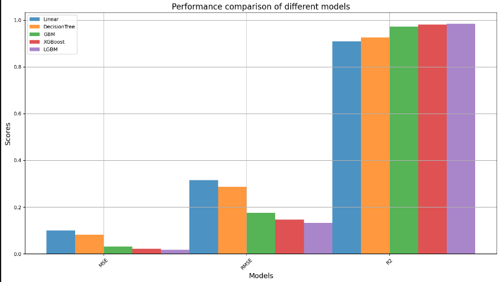
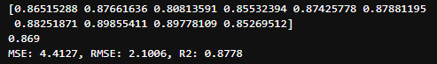
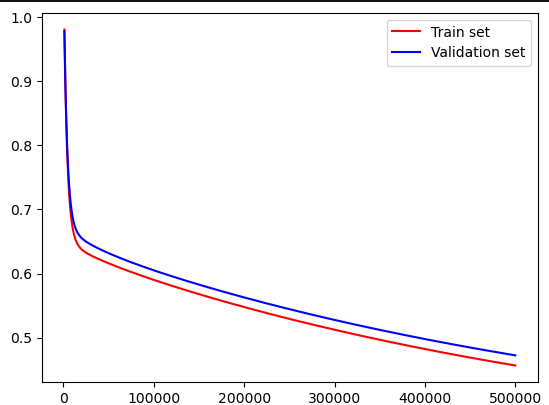
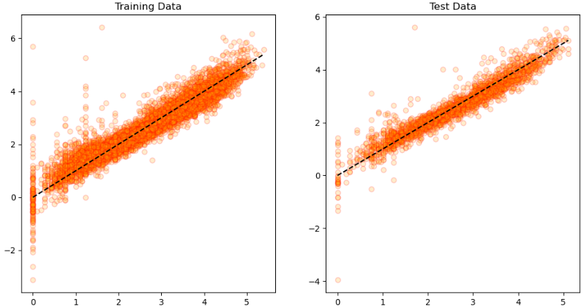
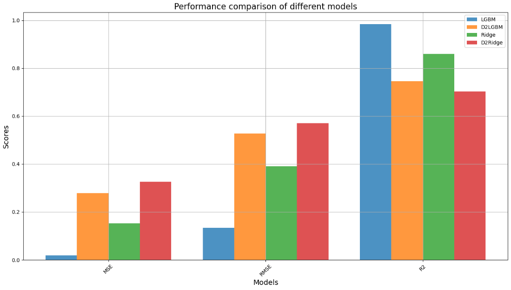

### NBA 득점예측

#### Features
         
-  team_abbreviation: 팀 약어
-  age: 나이               
-  player_height: 선수 키     
-  player_weight: 선수 몸무게                              
-  draft_round: 드래프트 라운드       
-  draft_number: 드래프트 번호       
-  gp: 경기 수 (games played)                             
-  reb: 리바운드 수 (rebounds)                
-  ast: 어시스트 수 (assists)                
-  net_rating: 넷 레이팅 (팀이 코트에 있을 때의 순 득실점)         
-  oreb_pct: 공격 리바운드 비율 (offensive rebound percentage)           
-  dreb_pct: 수비 리바운드 비율 (defensive rebound percentage)           
-  usg_pct: 사용률 (usage percentage, 선수가 팀의 공격에서 차지하는 비율)            
-  ts_pct: 슈팅 성공률 (true shooting percentage, 효율적인 슈팅 성공률)             
-  ast_pct: 어시스트 비율 (assist percentage, 팀의 필드골 중 이 선수가 어시스트한 비율)            

#### Target

-  pts: 득점 (points)

##### 목표

- 높은 득점을 기록할 수 있는 선수를 찾음으로써 경기운영 및 선수영입에 필요한 데이터를 찾는다.


---

#### 기본 전처리

- 결측치, 중복값 X
- 불필요 features제거
- target에 PowerTransformer 적용
- 범주형 데이터 LabelEncoder 적용


전체 모델들을 이용하여 선형 회귀 예측을 수행


```
LinearRegression
MSE: 0.0995, RMSE: 0.3154, R2: 0.9089
DecisionTreeRegressor
MSE: 0.0816, RMSE: 0.2856, R2: 0.9253
GradientBoostingRegressor
MSE: 0.0310, RMSE: 0.1761, R2: 0.9716
XGBRegressor
MSE: 0.0212, RMSE: 0.1455, R2: 0.9806
LGBMRegressor
MSE: 0.0175, RMSE: 0.1325, R2: 0.9839 
```

- Linear모델에서의 R2는 0.9089이며 다른 트리모델들도 R2점수가 높은수치로 나타나있다.
  과적합이 의심되는 상황이며 구체적인 비교가 필요.


- Kfold cross_val_score를 통한 비교


-  Pytorch를 통해 loss를 통한 비교


-  LinearRegression 사용하였을때 학습데이터와 테스트 데이터의 대한 예측값


```
MSE: 0.1027, RMSE: 0.3205, R2: 0.9068
MSE: 0.0995, RMSE: 0.3154, R2: 0.9089
```

---

#### 최적의 모델찾기

- Pipeline을 통해 StandardScaler 및 차원축소(2차원) 진행

- LGBMRegressor 모델을 통해 차원축소 적용

- Ridge 사용하여 규제적용(alpha=4000)

- Ridge 사용하여 규제적용(alpha=4000) 및 차원축소(2차원)



```
LGBMRegressor
MSE: 0.0179, RMSE: 0.1337, R2: 0.9836
D2LGBMRegressor
MSE: 0.2779, RMSE: 0.5271, R2: 0.7455
Ridge
MSE: 0.1526, RMSE: 0.3906, R2: 0.8603
D2Ridge
MSE: 0.3254, RMSE: 0.5704, R2: 0.7020
```

---
#### 결론

- 데이터가 많아져 차원축소를 해야한다면 LGM모델을 사용하여 효율을 높이고 효율을 따지지 않아도 된다면 Ridge를 사용하여 제약을 준다.
- 선수의 득점을 예측하여 경기중 위협선수에게 제약을 주거나 득점력이 있는 선수를 영입할 수 있는 판단의 근거를 만든다.
